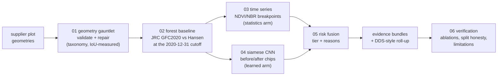

<div align="center">

# GeoVerdict

**From messy plot geometries to audit-ready EUDR verdicts.**

*A geospatial ML pipeline prototype: validate and repair supplier land-parcel
geometries, establish each plot's forest status at the EUDR cutoff
(31 Dec 2020), screen post-cutoff Sentinel-2 time series for clearing with a
statistics arm and a learned arm, fuse the evidence into a risk tier with
stated reasons, and emit an auditor-readable evidence bundle per plot.*

[](https://www.python.org/)
[](https://pytorch.org/)
[](https://sentinels.copernicus.eu/web/sentinel/missions/sentinel-2)
[](https://earthengine.google.com/)
[](notebooks/)
[](tests/)
[](LICENSE)

</div>

---

## Why this project exists

The EU Deforestation Regulation (EUDR, Regulation (EU) 2023/1115) requires
operators placing cattle, soy, cocoa, coffee, palm oil, rubber or wood
products on the EU market to prove the land that produced them was **not
deforested after 31 December 2020** — backed by geolocation data for every
plot of land involved.

That single sentence hides an entire engineering discipline:

1. supplier-submitted geometries arrive **damaged** (swapped axes, lost CRS,
   self-intersections, duplicates) and nothing downstream means anything
   until they are validated and repaired *with an audit trail*;
2. "was it forest at the cutoff" has **no single ground truth** — official
   maps disagree, and the disagreement concentrates in exactly the
   smallholder plots compliance is hardest for;
3. detecting post-cutoff clearing from optical satellites means confronting
   **cloud, seasonality and weak labels** honestly;
4. the output must be a **defensible decision with reasons**, not a
   probability — including an explicit "the record cannot say" tier;
5. every verdict needs **evidence and provenance** an auditor can open.

GeoVerdict is a working prototype of that whole chain, built end-to-end in
six notebooks that run top-to-bottom on free Google Colab, over a real
deforestation frontier (Novo Progresso, Pará, Brazil), using only free and
public data. It is an independent study project, inspired by the class of
problems EUDR-compliance teams work on; it uses no proprietary code or data.

## What the input actually is

The pipeline's input is a **plot portfolio** — a collection of per-plot records,
each with a geometry, an optional declared area, and a shared sourcing region
(AOI). Crucially, "geometry" is not assumed to be a clean polygon:

- **polygons / multipolygons** for plots > 4 ha (the EUDR norm), **or a single
  point** for plots ≤ 4 ha (allowed under EUDR Art. 9, buffered to a footprint);
- in **any CRS** — WGS84 is required, but Web-Mercator/UTM/national-grid inputs
  are detected and (where identifiable) re-projected, else refused;
- **correct or corrupted** — swapped lat/lon, self-intersections, duplicates,
  slivers, teleported coordinates are all diagnosed and repaired-or-refused;
- from any **file format** (GeoJSON, Shapefile, KML, WKT, CSV of lat/lon) —
  `geopandas`/`shapely` parse these into the geometries the validator consumes;
  GeoVerdict operates on geometries, not formats.

Chapter 01 makes this contract explicit and exercises every case. The short
answer to *"is the input just polygons?"* is **no** — turning messy,
mixed-type, mixed-CRS submissions into a trustworthy analysable footprint (or
an honest refusal) is the first ML-adjacent problem the pipeline solves.

## The pipeline



Click **Open in Colab** to launch any chapter directly (each notebook also
carries the badge at its top on GitHub). Run them **in order 01 → 06** — later
chapters load earlier chapters' outputs from your Google Drive.

| # | Notebook | Runtime | The question it answers |
|---|---|---|---|
| 01 | [`01_geometry_gauntlet`](notebooks/01_geometry_gauntlet.ipynb) [](https://colab.research.google.com/github/SaadH-077/geoverdict/blob/main/notebooks/01_geometry_gauntlet.ipynb) | CPU | Which failure classes can we *detect* and how much geometry can we *repair* — measured per class against a known answer key? |
| 02 | [`02_forest_baseline`](notebooks/02_forest_baseline.ipynb) [](https://colab.research.google.com/github/SaadH-077/geoverdict/blob/main/notebooks/02_forest_baseline.ipynb) | CPU + GEE | Was each plot forest at the cutoff — and how often does the answer depend on which official map you consult? |
| 03 | [`03_timeseries_screening`](notebooks/03_timeseries_screening.ipynb) [](https://colab.research.google.com/github/SaadH-077/geoverdict/blob/main/notebooks/03_timeseries_screening.ipynb) | CPU + GEE | When did each plot's forest signal break, from its own six-year NDVI/NBR history — before any deep learning? |
| 04 | [`04_learned_detector`](notebooks/04_learned_detector.ipynb) [](https://colab.research.google.com/github/SaadH-077/geoverdict/blob/main/notebooks/04_learned_detector.ipynb) | CPU + GEE (GPU optional) | Do *pixels* beat plot-mean series — and does the training data (hard negatives) matter more than the architecture? |
| 05 | [`05_verdicts_evidence`](notebooks/05_verdicts_evidence.ipynb) [](https://colab.research.google.com/github/SaadH-077/geoverdict/blob/main/notebooks/05_verdicts_evidence.ipynb) | CPU | What is the defensible verdict per plot, what does it cost in analyst hours, and what does the auditor open? |
| 06 | [`06_verification`](notebooks/06_verification.ipynb) [](https://colab.research.google.com/github/SaadH-077/geoverdict/blob/main/notebooks/06_verification.ipynb) | GPU (1 retrain) | Which claims survive ablation, seed variance, and a deliberate demonstration of the random-split trap? |

## Results

Every number this project asserts is written to `outputs/results.json` by
the notebook that measured it, and chapter 06 re-derives the key claims from
raw artefacts. **This README deliberately contains no hand-typed metrics** —
run the notebooks (order 01 → 06) and the ledger is the results table. The
headline *shapes* to look for:

- the intake funnel: what share of a damaged submission becomes analysable
  automatically, what is honestly refused to manual review, and repair
  quality (IoU vs intended geometry) per failure class;
- the share of plots whose forest-at-cutoff status **flips between JRC
  GFC2020 and Hansen**, concentrated in small plots;
- statistics arm vs random forest vs siamese CNN on **identical,
  spatially-blocked test plots** — PR-AUC and flags-per-1,000 at 90% recall;
- the **hard-negative ablation**: precision at 90% recall with vs without
  TMF stable-forest negatives in training;
- the **split experiment**: how much a random split inflates PR-AUC over the
  honest spatial split, measured on the same model.

## Design decisions, defended in one line each

The short form; the long form lives in module docstrings and notebook prose.

| Decision | Why |
|---|---|
| Diagnose → repair → re-validate, never silent fixes | An unlogged fix is how a swapped-axes plot in the wrong hemisphere gets a confident verdict; the validator, not the repairer, declares success. |
| Corruption harness with seeded answer key | Real damaged data has no ground truth; manufactured damage makes repair quality *measurable* per failure class. |
| Two forest baselines, not one | The official maps disagree; a system that silently picks one hides a judgement call inside a lookup. Disagreement becomes a MEDIUM signal. |
| Median/MAD baselines, per plot | Residual cloud leaves heavy-tailed outliers; a mean-based baseline is dragged by exactly the artefacts to ignore. Thresholds adapt per plot. |
| Persistence rule (3 consecutive obs) | One low month is weather; three sustained months on formerly forested land is clearing. Swept, not asserted (ch. 06). |
| Gaps stay gaps | Interpolating through the wet season invents observations where the tropics have none; unobservable plots get INSUFFICIENT, never LOW. |
| Chip classification, not segmentation | The compliance unit is the plot; 30 m weak-label edges are what a 10 m segmentation loss would fixate on. |
| Siamese encoder, `[f2−f1, f1, f2]` head | Same sensor, same land → same features; the difference carries *what changed*, the absolutes say what it changed *from*. |
| Hard negatives from TMF | Negatives that teach the boundary are textured stable forest, not easy pasture — and the ablation shows data beats architecture. |
| Ambiguous Hansen band (2–20%) excluded from training | Training on labels you don't trust injects noise you can't later diagnose. Excluded from training, still screened at inference. |
| Spatially-blocked splits | Neighbouring plots share weather, soil and scenes; random splits grade the model on memorised neighbourhoods (inflation measured in ch. 06). |
| Plot-normalised metrics | Pixel pooling lets one 300 ha ranch outvote fifty smallholders — who are exactly whom compliance is hardest for. |
| Temperature scaling before fusion | The verdict layer reads p ≥ 0.7 as evidence; that sentence is only meaningful if 0.7 means 70%. |
| Rule-based fusion over learned fusion | No labelled EUDR adjudications exist to learn from, and "HIGH because an ensemble said 0.83" does not survive an auditor. ML in the evidence, transparency in the decision. |
| GEE for reductions, STAC/COG for pixels | Server-side reduction where the data is huge and the answer is small; windowed COG reads where pixel control matters. Per-workload, not one-tool-fits-all. |

## Running it (Google Colab, free tier)

1. Fork/clone this repo to your GitHub, set `GITHUB_USER` in each notebook's
   first code cell.
2. Create a free [Earth Engine](https://code.earthengine.google.com) cloud
   project; put its id in `EE_PROJECT` (notebooks 02–04).
3. Run the notebooks **in order, 01 → 06**. Each mounts Google Drive and
   persists `outputs/` + `figures/` to `MyDrive/geoverdict`, so later
   chapters (and re-runs after a disconnect) pick up where earlier ones left
   off. Every notebook runs on a **CPU** runtime — the notebook-4 CNN is small
   enough that a GPU only shaves a few minutes off training and is optional.
4. Locally: `pip install -r requirements.txt && pytest` (50 tests, no
   geospatial credentials needed — the library core is dependency-light by
   design).

Notebooks are **generated artefacts**: the sources of truth are
`scripts/nb0*.py` (readable, diffable). Edit there and rebuild with
`python scripts/nb01_geometry.py` etc.

## Repository layout

```
GeoVerdict/
├── src/geoverdict/
│   ├── config.py      # AOI, cutoff, seeds, ledger — one definition, imported everywhere
│   ├── geometry.py    # validation taxonomy + measured repair (shapely only, fully tested)
│   ├── corrupt.py     # seeded corruption harness — the answer key
│   ├── gee.py         # Earth Engine: baselines, TMF hard negatives, server-side S2 series
│   ├── s2.py          # Earth Search STAC + windowed COG reads, per plot
│   ├── timeseries.py  # monthly compositing, median/MAD breakpoint detector
│   ├── models.py      # siamese change CNN + training loop
│   ├── metrics.py     # PR-centric, plot-normalised, calibration, business units
│   ├── risk.py        # transparent evidence fusion -> LOW/MEDIUM/HIGH/INSUFFICIENT
│   ├── evidence.py    # per-plot audit bundles + DDS-style portfolio roll-up
│   └── viz.py         # one style for every figure; fixed colour semantics
├── notebooks/         # six chapters, generated from scripts/
├── scripts/           # notebook sources (nbbuild.py + nb01..nb06)
├── tests/             # 50 pytest cases: geometry round-trips, detector truths,
│                      #   metric properties, verdict gates, model smoke tests
└── outputs/, figures/ # created at run time (Drive on Colab)
```

## Data sources & credits

All free and public. Exact asset versions used are recorded in provenance
files at run time — in a compliance product, provenance *is* the feature.

- **Sentinel-2 L2A** — Copernicus programme; via
  [Earth Search STAC](https://earth-search.aws.element84.com/v1) (COGs, no
  auth) and `COPERNICUS/S2_SR_HARMONIZED` on Earth Engine.
- **JRC Global Forest Cover 2020** — EC Joint Research Centre; the
  EUDR-relevant forest baseline.
- **Hansen Global Forest Change** (Hansen et al., Science 2013, updated) —
  Univ. of Maryland; baseline cross-check and post-2020 loss reference.
- **JRC Tropical Moist Forest** — annual change product; stable-forest hard
  negatives.
- **Whisp** ([Forest Data Partnership / FAO Open Foris](https://github.com/forestdatapartnership/whisp))
  — real example plot geometries used as an external validator check, and
  the open-source reference point for EUDR plot screening.

**Not** affiliated with, and containing no code or data from, any commercial
EUDR compliance product.

## Limitations

Written by the author, with costs and remedies, in
[notebook 06](notebooks/06_verification.ipynb) — synthetic plot geometries,
weak Landsat-family labels, optical-only monitoring, clearing (not
degradation), one AOI, small-sample calibration. Read them before the
results.

## License

MIT — see [LICENSE](LICENSE).
